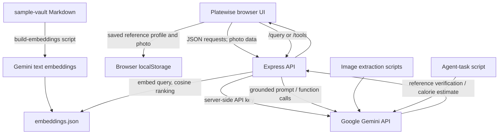

# Architecture

`GEMINI_API_KEY` is read only by Node.js on the server and command-line scripts. The browser never receives it. `/train-reference` asks Gemini Vision to verify a labeled reference object; `/analyze-food` estimates a meal using the food and reference images. `/query` embeds a question, retrieves the closest note chunks, then asks Gemini to answer from those sources. `/tools` lets Gemini request bounded local arithmetic or knowledge-base search. Image extraction and chained agent tasks are separate CLI workflows.

If the key is absent, AI endpoints return HTTP 503 instead of substituting a mock. The knowledge assistant can still run without an index, but is instructed to say when it has no supporting sources.
